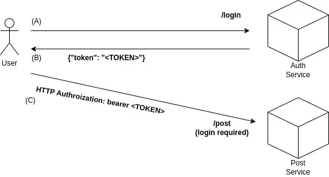

# Introduction

Nowadays, I am eager to learn microservices architecture and technologies. I was super wondering that how to handle authentication between different systems? In this repo, I experienced that in the easiest way.

Also, you can check [my text I published on Medium](https://mebaysan.medium.com/jwt-auth-101-e78aeef640c) that I wrote to explain this code.



# Containers & Images

## Auth Service

[auth101-auth](https://hub.docker.com/repository/docker/mebaysan/auth101-auth)

```bash
docker pull mebaysan/auth101-auth

docker container run -d -p 5000:5000 mebaysan/auth101-auth
```

## Gateway Service

[auth101-gateway](https://hub.docker.com/repository/docker/mebaysan/auth101-gateway)

```bash
docker pull mebaysan/auth101-gateway

docker container run -d -p 8080:8080 mebaysan/auth101-gateway
```

# Nomad Applied Example

After installing [Nomad](https://www.nomadproject.io/) and creating a local dev agent, you can execute [nomad_start.sh](./nomad/nomad_start.sh) script.


```bash
sudo apt-get install python3-httpx

# 172.17.0.3 => IP address given by Nomad to the task(s), you can check is it the same on your local or not.

# To be authenticated
httpx -m POST --auth user@user.com Passw0rd http://172.17.0.3:8080/login

# Get all posts in the db (you have to be authenticated)
httpx -m GET -h "Authorization" "Bearer <TOKEN>" http://172.17.0.3:8080/posts

# Add a new post to the db (you have to be authenticated)
httpx -m POST -h "Authorization" "Bearer <TOKEN>" -j '{"id":1, "title": "Title Text"}' http://172.17.0.3:8080/posts
```